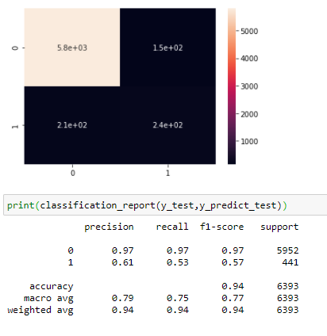
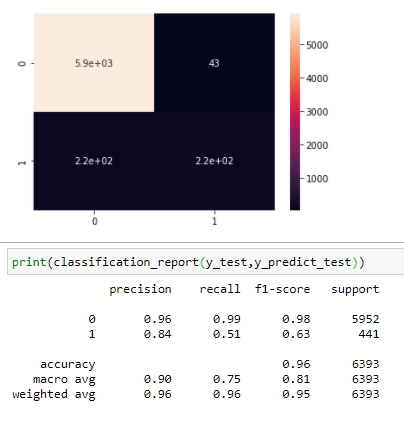

# Twitter-Sentimental-Analysis-using-NLP

Trained a Naive Bayes classifier to predict sentiment from thousands of Twitter tweets. This project could be practically used by any company with social media presence to automatically predict customer's sentiment (i.e.: whether their customers are happy or not). The process could be done automatically without having humans manually review thousands of tweets and customer reviews.

### Naive Bayes Output

Fig: With Naive Bayes we are able to achieve f1 score of 94% accuracy

### Logistic Regression Output

Fig: With Logistic Regression we are able to achieve f1 score of 96% accuracy.
